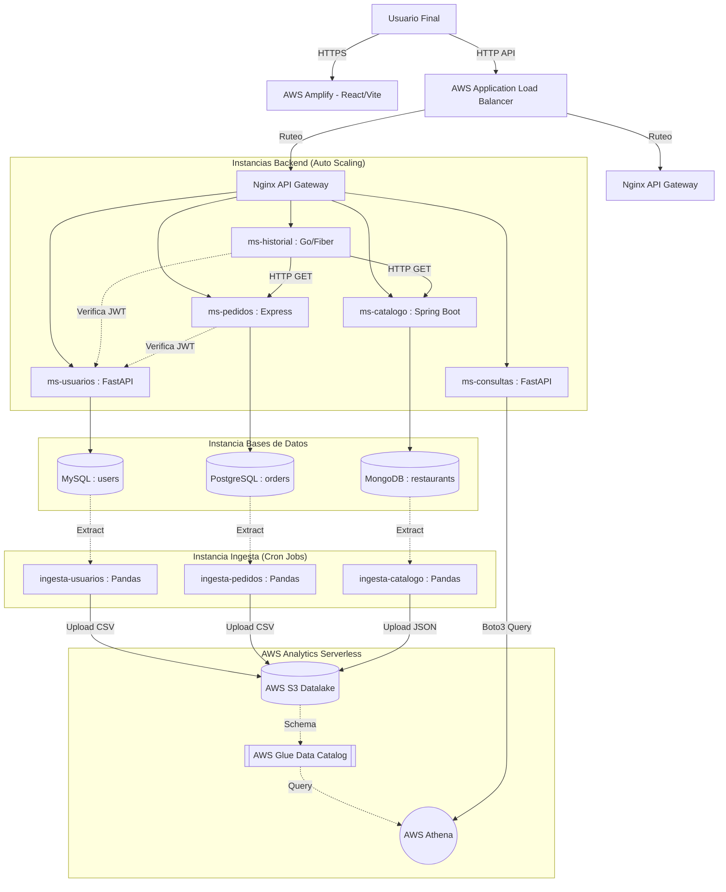

# Proyecto Parcial - Cloud Computing
**CS2032 - Ciclo 2026-2**

Este repositorio contiene la arquitectura completa para el despliegue del proyecto en **AWS Academy**, estructurado para facilitar la automatización y el trabajo en equipo.

## Arquitectura del Proyecto

El proyecto está dividido en tres áreas principales organizadas en carpetas:

### 1. `backend/` (Microservicios)
Contiene 5 microservicios dockerizados y un API Gateway (Nginx). Cumple con el requisito de usar 3 lenguajes de programación distintos:
- **`ms-usuarios`**: Python (FastAPI) + MySQL. Gestiona autenticación y perfiles de usuario. Implementa RBAC (Role-Based Access Control) y generación de JWTs.
- **`ms-pedidos`**: Node.js (Express) + PostgreSQL. Gestiona la creación de órdenes de comida. Verifica firmas JWT para asegurar que los usuarios solo vean sus propios pedidos.
- **`ms-catalogo`**: Java (Spring Boot) + MongoDB. Administra restaurantes y platos. Incorpora soporte polimórfico para IDs (ObjectID y String/Int) y sincronización con el frontend.
- **`ms-historial`**: Go (Fiber) + MongoDB. Consume datos de otros microservicios armando un dashboard. Protegido mediante middlewares de validación JWT.
- **`ms-consultas`**: Python (FastAPI). Microservicio analítico que consulta a AWS Athena mediante `boto3`, extrayendo las vistas requeridas por la rúbrica.
- **`nginx/`**: Reverse Proxy que actúa como API Gateway interno exponiendo todos los servicios por el puerto 80.

### 2. `frontend/` (AWS Amplify)
Aplicación Single-Page Application (SPA) construida en **React + Vite**.
- Diseño moderno estilo "App de Comida" (Rappi/PedidosYa).
- Cumple la rúbrica al consumir los 5 microservicios mediante llamadas reales `fetch()` e inyecta automáticamente tokens JWT de autorización (`fetchAuth`).
- Se configura automáticamente para entornos locales o producción mediante la variable de entorno `VITE_API_URL`.

### 3. `data-science/` (Ingesta y Analytics)
Contiene scripts en Python diseñados para ejecutarse en contenedores Docker bajo la estrategia *Pull*. Se conectan a las 3 bases de datos (SQL y NoSQL), extraen el 100% de la información y la suben a un **Bucket S3** en formato CSV o JSON. Esta data será catalogada en AWS Glue y consultada desde AWS Athena por `ms-consultas`. *(Pendiente de completar la codificación de los contenedores).*

---

## Endpoints de los microservicios

La siguiente lista corresponde a las rutas implementadas actualmente en el código. Al desplegarse en AWS o localmente con Nginx, todas pasan por el puerto 80 del Balanceador/Proxy.

### Usuarios (`ms-usuarios`)
| Método | Endpoint | Descripción |
|---|---|---|
| `GET` | `/` | Verifica que el servicio esté activo. |
| `POST` | `/register` | Registra un usuario y su dirección. |
| `POST` | `/login` | Autentica al usuario y devuelve un token JWT. |
| `GET` | `/usuarios` | Lista los usuarios. |
| `GET` | `/usuarios/{user_id}` | Obtiene un usuario por ID. |
| `GET` | `/docs` | Swagger UI. |

### Pedidos (`ms-pedidos`)
| Método | Endpoint | Descripción |
|---|---|---|
| `GET` | `/` | Verifica que el servicio esté activo. |
| `GET` | `/orders` | Lista los últimos 100 pedidos. |
| `POST` | `/orders` | Crea un pedido. |
| `GET` | `/orders/{id}` | Obtiene un pedido y sus ítems. |
| `PUT` | `/orders/{id}` | Actualiza el estado de un pedido. |
| `DELETE` | `/orders/{id}` | Elimina un pedido. |
| `GET` | `/orders/user/{userId}` | Lista los pedidos de un usuario. |
| `GET` | `/orders/restaurant/{restaurantId}` | Lista los pedidos de un restaurante. |
| `GET` | `/docs` | Swagger UI. |

### Catálogo (`ms-catalogo`)
| Método | Endpoint | Descripción |
|---|---|---|
| `GET` | `/health` | Verifica que el servicio esté activo. |
| `GET` | `/api/restaurantes` | Lista los restaurantes. |
| `POST` | `/api/restaurantes` | Crea un restaurante con sus platos y reseñas. |
| `GET` | `/api/restaurantes/platos/{dishId}` | Obtiene los datos de un plato por ID. |
| `GET` | `/api/restaurantes/favorito/{userId}` | Obtiene el restaurante favorito (requerido por ms-historial). |

### Historial (`ms-historial`)
| Método | Endpoint | Descripción |
|---|---|---|
| `GET` | `/health` | Verifica que el servicio esté activo. |
| `GET` | `/api/dashboard?userId={userId}` | Agrega datos del usuario, restaurante favorito e historial de pedidos. |
| `GET` | `/docs` | Swagger UI. |

### Consultas (`ms-consultas`)
| Método | Endpoint | Descripción |
|---|---|---|
| `GET` | `/health` | Verifica que el servicio esté activo. |
| `GET` | `/api/analitica/ventas-restaurante?limit={limit}` | Vista Analítica 1: Reporte de ventas totales por Restaurante. |
| `GET` | `/api/analitica/usuarios-frecuentes?limit={limit}` | Vista Analítica 2: Reporte de usuarios con mayor cantidad de pedidos. |
| `GET` | `/docs` | Swagger UI. |

---

## Guía de Despliegue en AWS Academy

Existen dos opciones de despliegue, dependiendo de tu preferencia. **En ninguna opción necesitas crear archivos `.env` a mano, los scripts los auto-generan.**

### Opción A: Despliegue 100% Automatizado ("Zero-Touch")
Si cuentas con AWS CLI configurado (por ejemplo, desde AWS Cloud9) y deseas que todo se arme solo sin usar SSH:
1. Asegúrate de tener permisos básicos en AWS Academy.
2. Ejecuta el script maestro pasándole la URL de tu repo y el nombre de tu S3 Bucket:
   ```bash
   bash deploy-aws-infra.sh https://github.com/TU_USUARIO/mv-categorias.git mi-bucket-cloudeats-123
   ```
3. **El script hará la magia:** 
   - Creará los Security Groups con sus reglas exactas.
   - Lanzará las MVs de BBDD, Backend e Ingesta inyectándoles `UserData` para que se instalen solas.
   - Creará el Load Balancer y enlazarás las instancias Backend.
   - Auto-inyectará **más de 35,000 registros de Fake Data**.
   - Compilará tu código React inyectándole el Load Balancer final.
4. Sube la carpeta compilada `frontend/dist/` a AWS Amplify (Drag & Drop).

### Opción B: Despliegue Paso a Paso por Consola
Si prefieres levantar tú mismo las instancias EC2 en la consola de AWS (usando AMI Cloud9Ubuntu22):
1. **Bases de Datos:** Entra por SSH a tu MV-BBDD y corre `bash deploy-dbs.sh`.
2. **Backend (x2):** Entra por SSH a tus MVs y corre `bash deploy-apps.sh <IP_BBDD>`. *(Esto también auto-generará 35,000+ fake records).*
3. **Data Science:** Entra a la MV-Ingesta y corre `bash deploy-ingesta.sh <IP_BBDD> <BUCKET_S3>`. *(Este script extraerá la data y auto-configurará **AWS Glue** y **Athena**).*
4. **Frontend:** Corre localmente `bash deploy-frontend.sh <URL_DEL_LOAD_BALANCER>` y sube el compilado a Amplify.

---

## Mantenimiento y Actualización Remota (AWS SSM)

Si en el futuro modificas código del Frontend, Backend, Ingesta o Athena, **no necesitas conectarte por SSH a las MVs** para actualizarlo. Hemos automatizado esto usando AWS Systems Manager.
1. Haz un `git push` de tus cambios a GitHub.
2. Desde tu terminal local o Cloud9, ejecuta:
   ```bash
   bash update-infrastructure.sh
   ```
Este script actualizará remotamente el código en todas las instancias EC2, reconstruirá los contenedores de Docker (Zero-Downtime), actualizará las consultas de Athena e incluso recompilará tu frontend automáticamente.

---

## Diagrama de Arquitectura de Solución (Para la Rúbrica)

Puedes generar el diagrama requerido para la presentación usando este código [Mermaid](https://mermaid.live). Cópialo y pégalo en cualquier visor de Markdown o en Notion:

